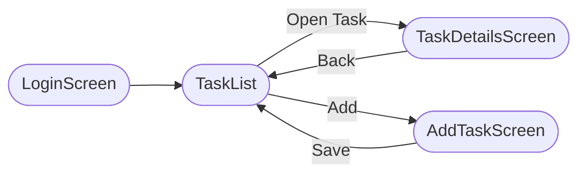
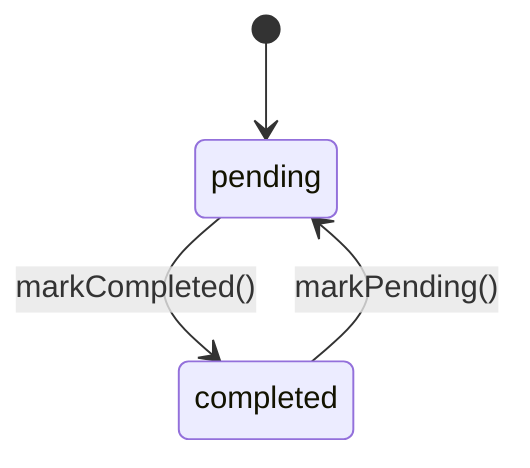

# Ticksy

Ticksy is a React Native (Expo) task manager with local persistence, light/dark theming, and internationalization (English and Arabic with RTL support). Version **1.0.0**.

## Features
- Lightweight demonstration authentication state (no backend; device‑local only) persisted via AsyncStorage.
- Task management: create, list, update status, and delete.
- Light/Dark theme toggle with persistence.
- Internationalization using i18next/react‑i18next and expo‑localization (English/Arabic + RTL).
- React Navigation v7 (native stack) with a simple, predictable screen flow.
- Styling with NativeWind (Tailwind for React Native).

## Tech Stack
- Expo + React Native (TypeScript)
- React Navigation v7, AsyncStorage
- i18next/react‑i18next with expo‑localization
- NativeWind (Tailwind), React Native Reanimated

## Project Structure (partial)
```text
Ticksy-main/
├── assets/
│   ├── adaptive-icon.png
│   ├── favicon.png
│   ├── icon.png
│   └── splash.png
├── components/
│   ├── auth/
│   ├── common/
│   └── tasks/
├── locales/
│   ├── ar/
│   └── en/
├── types/
│   └── index.ts
├── utils/
│   ├── auth.tsx
│   ├── i18n.tsx
│   ├── storage.ts
│   ├── theme.tsx
│   └── validation.ts
├── App.tsx
├── app.json
├── babel.config.js
├── cesconfig.jsonc
├── eslint.config.js
├── global.css
├── metro.config.js
├── nativewind-env.d.ts
├── package-lock.json
├── package.json
├── prettier.config.js
├── tailwind.config.js
└── tsconfig.json
```

Key modules:
- `utils/storage.ts`: AsyncStorage CRUD (tasks, auth, theme, language)
- `utils/auth.tsx`: Authentication context (demo login/logout only)
- `utils/i18n.tsx`: i18n setup and RTL handling
- `utils/theme.tsx`: Theme context and toggle
- `components/tasks/*`: Task screens and cards
- `components/common/*`: UI primitives (Button, Input, EmptyState)
- `locales/*`: Translations

## Getting Started

### Prerequisites
- Node 18+ and npm
- Expo tooling (use `npx expo` without a global install)
- Android Studio / Xcode / Expo Go for device testing

### Installation and Running
```bash
npm install
npm run start   # starts Expo dev server
# optional convenience targets
npm run android
npm run ios
npm run web
```

### Linting and Formatting
```bash
npm run lint
npm run format
```

## Environment
No `.env` is required. All state is stored locally with AsyncStorage.

## Navigation Map


## Task Lifecycle


## Testing Suggestions
- Component tests with React Native Testing Library.
- Storage unit tests by mocking `@react-native-async-storage/async-storage`.
- i18n snapshot tests per locale.

## Security and Limitations
- No real backend; credentials are not verified.
- Data is device‑local; uninstalling the app removes its data.
- Do not use the included auth approach in production environments.

## Scripts
```json
{
  "android": "expo run:android",
  "ios": "expo run:ios",
  "start": "expo start",
  "prebuild": "expo prebuild",
  "lint": "eslint \"**/*.{js,jsx,ts,tsx}\" && prettier -c \"**/*.{js,jsx,ts,tsx,json}\"",
  "format": "eslint \"**/*.{js,jsx,ts,tsx}\" --fix && prettier \"**/*.{js,jsx,ts,tsx,json}\" --write",
  "web": "expo start --web"
}
```

## Dependencies
### Production
| Package | Version |
|---|---|
| `@react-native-async-storage/async-storage` | `^2.2.0` |
| `@react-native-community/datetimepicker` | `^8.5.0` |
| `@react-navigation/native` | `^7.1.19` |
| `@react-navigation/native-stack` | `^7.6.2` |
| `expo` | `^54.0.0` |
| `expo-localization` | `^17.0.7` |
| `expo-status-bar` | `~3.0.8` |
| `i18next` | `^25.6.0` |
| `lottie-react-native` | `^7.3.4` |
| `nativewind` | `latest` |
| `react` | `19.1.0` |
| `react-dom` | `19.1.0` |
| `react-i18next` | `^16.2.3` |
| `react-native` | `0.81.5` |
| `react-native-gesture-handler` | `^2.29.0` |
| `react-native-reanimated` | `~4.1.1` |
| `react-native-safe-area-context` | `~5.6.0` |
| `react-native-screens` | `~4.16.0` |
| `react-native-web` | `^0.21.0` |
| `react-native-worklets` | `0.5.1` |

### Development
| Package | Version |
|---|---|
| `@babel/core` | `^7.20.0` |
| `@types/react` | `~19.1.10` |
| `eslint` | `^9.25.1` |
| `eslint-config-expo` | `~10.0.0` |
| `eslint-config-prettier` | `^10.1.2` |
| `prettier` | `^3.2.5` |
| `prettier-plugin-tailwindcss` | `^0.5.11` |
| `tailwindcss` | `^3.4.0` |
| `typescript` | `~5.9.2` |

---
© 2025 Ticksy – for internal demonstrations.
